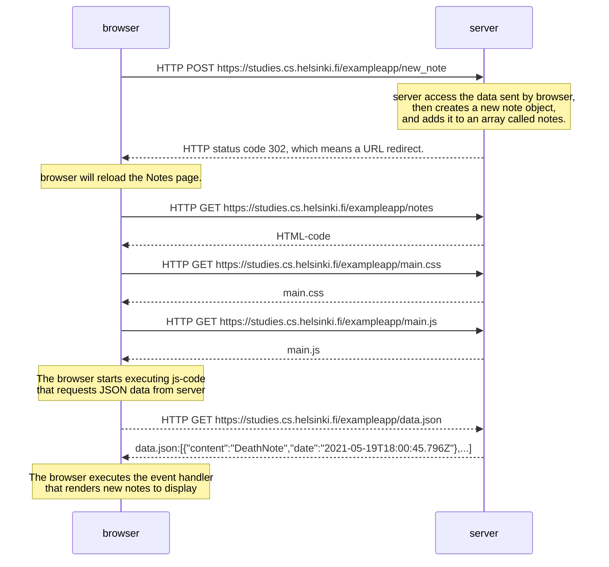

Next let's examine how adding a new note is done.

The note page contains a `form element`.

When the button on the form is clicked, the browser will send the user input to the server. Let's open the Network tab and see what submitting the form looks like:

