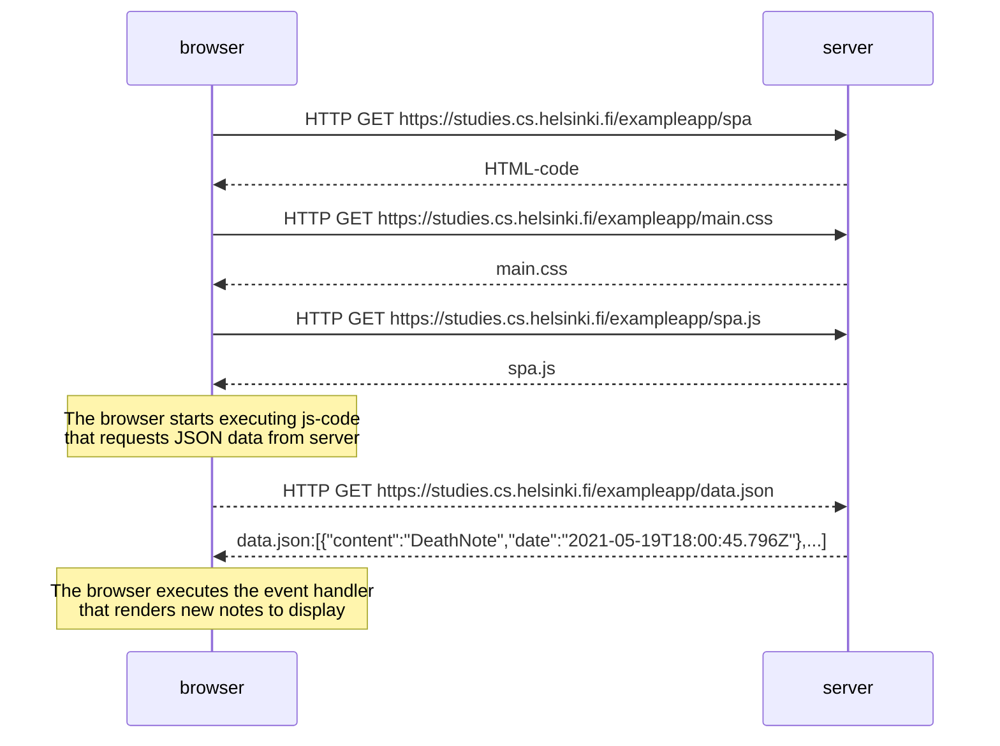

Create a diagram depicting the situation where the user goes to the single page app version of the notes app at https://studies.cs.helsinki.fi/exampleapp/spa.

Let's review what happens when the page https://studies.cs.helsinki.fi/exampleapp/spa is opened on the browser.

